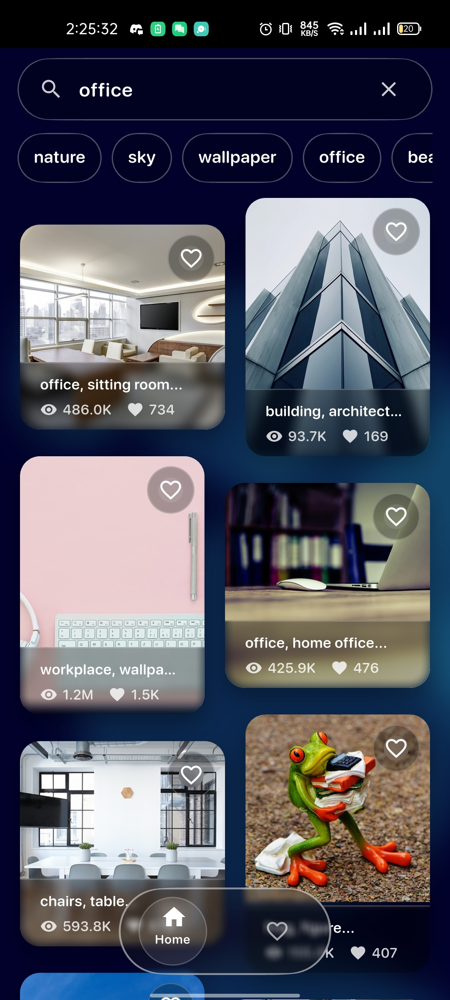
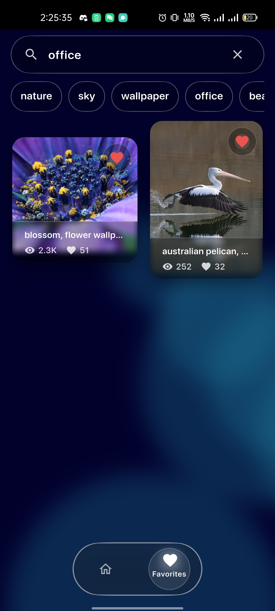
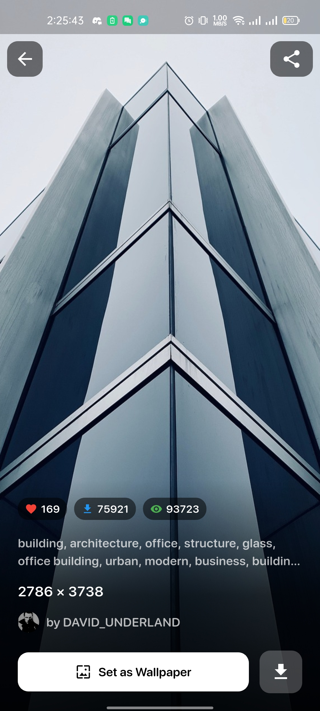
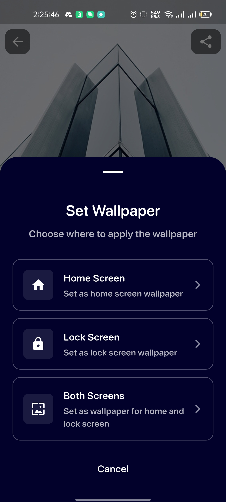
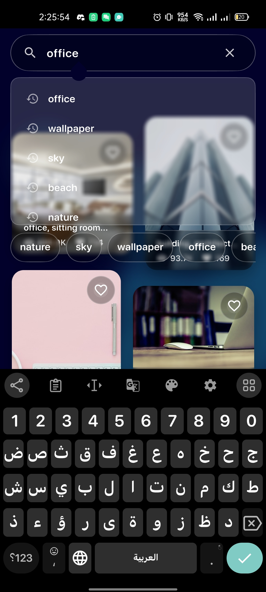

# Photofiy 📸

A beautiful Flutter application for discovering, viewing, and managing high-quality images from Pixabay. Set stunning wallpapers, save favorites, and explore a vast collection of royalty-free images with an elegant glassmorphism UI.

## Screenshots

<div align="center">
  <table>
    <tr>
      <td align="center">
        
        <br/>
        <em>Home Screen</em>
      </td>
      <td align="center">
        
        <br/>
        <em>Image Gallery</em>
      </td>
      <td align="center">
        
        <br/>
        <em>Search Results</em>
      </td>
    </tr>
    <tr>
      <td align="center">
        
        <br/>
        <em>Image Detail View</em>
      </td>
      <td align="center">
        
        <br/>
        <em>Favorites Collection</em>
      </td>
      <td align="center">
        <!-- Space for additional screenshots -->
      </td>
    </tr>
  </table>
</div>

*Beautiful glassmorphism UI showcasing high-quality images with smooth animations and intuitive navigation*

## Features ✨

### 🖼️ Image Discovery
- **Browse High-Quality Images**: Access millions of royalty-free images from Pixabay
- **Smart Search**: Search for images by keywords with auto-suggestions
- **Category Filtering**: Filter images by categories, types, and orientations
- **Infinite Scroll**: Seamless pagination for browsing through image collections

### ⭐ Favorites Management
- **Save Favorites**: Mark images as favorites for quick access later
- **Local Storage**: Favorites are stored locally using Hive database
- **Easy Management**: Add or remove favorites with a single tap

### 🎨 Wallpaper Features
- **Set as Wallpaper**: Directly set any image as your device wallpaper
- **Multiple Options**: Choose between home screen, lock screen, or both
- **High Resolution**: Download and set high-quality wallpapers

### 📱 Modern UI/UX
- **Glassmorphism Design**: Beautiful frosted glass effects throughout the app
- **Dark Theme**: Elegant dark mode for comfortable viewing
- **Smooth Animations**: Fluid transitions and hero animations
- **Responsive Layout**: Adaptive design that works on different screen sizes

### 🚀 Additional Features
- **Image Sharing**: Share images directly from the app
- **Download Support**: Save images to your device
- **Search History**: Keep track of your recent searches
- **Offline Favorites**: Access your favorite images even without internet
- **Interactive Viewer**: Zoom and pan to view image details

## Architecture 🏗️

This app follows **Clean Architecture** principles with **BLoC** pattern for state management:

```
lib/
├── app/                    # App configuration
├── config/                 # Routes and themes
├── core/                   # Core utilities and services
├── features/               # Feature modules
│   ├── home/              # Home screen with image grid
│   │   ├── data/          # Data layer (repositories, models)
│   │   ├── domain/        # Domain layer (entities, use cases)
│   │   └── view/          # Presentation layer (screens, widgets, BLoC)
│   ├── image/             # Image detail and actions
│   └── favorite/          # Favorites management
└── main.dart              # App entry point
```

### Key Architectural Components:
- **BLoC Pattern**: For predictable state management
- **Repository Pattern**: For data abstraction
- **Use Cases**: For business logic separation
- **Dependency Injection**: Using GetIt for service location
- **Clean Architecture**: Separation of concerns across layers

## Tech Stack 🛠️

### Core Framework
- **Flutter**: Cross-platform mobile development
- **Dart**: Programming language

### State Management
- **flutter_bloc**: BLoC pattern implementation
- **bloc**: Core BLoC library

### Navigation
- **go_router**: Declarative routing solution

### Networking
- **dio**: HTTP client for API requests
- **connectivity_plus**: Network connectivity monitoring
- **pretty_dio_logger**: Request/response logging

### Local Storage
- **hive**: NoSQL database for local storage
- **shared_preferences**: Simple key-value storage
- **flutter_secure_storage**: Secure storage for sensitive data

### Image Handling
- **cached_network_image**: Image caching and loading
- **flutter_staggered_grid_view**: Staggered grid layouts

### Device Features
- **wallpaper_manager_flutter**: Set wallpapers
- **share_plus**: Share functionality
- **permission_handler**: Handle device permissions
- **path_provider**: Access device directories

### UI/UX
- **liquid_glass_renderer**: Glassmorphism effects
- **Custom widgets**: Beautiful glassmorphic components

### Development
- **flutter_lints**: Code quality and style guidelines
- **freezed**: Code generation for immutable classes
- **equatable**: Value equality comparisons

## API Integration 🌐

The app integrates with the **Pixabay API** to fetch high-quality images:

- **Base URL**: `https://pixabay.com/api/`
- **Features**: Search, filter, and pagination
- **Image Types**: Photos, illustrations, vectors
- **High Resolution**: Access to various image sizes including HD

### Getting Started with Pixabay API:
1. Visit [Pixabay API Documentation](https://pixabay.com/api/docs/)
2. Sign up for a free account
3. Get your API key
4. Add it to `lib/core/constants/app_apis.dart`

## Installation 📲

### Prerequisites
- Flutter 3.8.1 or higher
- Dart SDK
- Android Studio / VS Code
- Android/iOS device or emulator

### Setup Instructions

1. **Clone the repository**
   ```bash
   git clone https://github.com/your-username/photofiy.git
   cd photofiy
   ```

2. **Install dependencies**
   ```bash
   flutter pub get
   ```

3. **Configure Pixabay API**
   - Open `lib/core/constants/app_apis.dart`
   - Replace the empty `apiKey` with your Pixabay API key:
   ```dart
   static const String apiKey = 'YOUR_PIXABAY_API_KEY_HERE';
   ```

4. **Run the app**
   ```bash
   flutter run
   ```

### Building for Release

**Android APK:**
```bash
flutter build apk --release
```

**Android Bundle:**
```bash
flutter build appbundle --release
```

**iOS:**
```bash
flutter build ios --release
```

## Permissions 🔐

The app requires the following permissions:

### Android
- `INTERNET`: For downloading images from Pixabay API
- `WRITE_EXTERNAL_STORAGE`: For saving downloaded images
- `SET_WALLPAPER`: For setting wallpapers

### iOS
- Network access for API calls
- Photo library access for saving images

## Project Structure 📁

```
photofiy/
├── android/                # Android-specific files
├── ios/                    # iOS-specific files
├── lib/                    # Flutter source code
│   ├── app/               # App configuration
│   ├── config/            # App configuration (routes, theme)
│   ├── core/              # Core utilities and services
│   │   ├── constants/     # App constants and APIs
│   │   ├── network/       # Network utilities
│   │   ├── services/      # Services (Hive, DI)
│   │   ├── shared/        # Shared utilities
│   │   └── utils/         # Helper utilities
│   ├── features/          # Feature modules
│   │   ├── home/          # Home screen features
│   │   ├── image/         # Image detail screen
│   │   └── favorite/      # Favorites management
│   └── main.dart          # Entry point
├── pubspec.yaml           # Dependencies
└── README.md              # This file
```

## Contributing 🤝

Contributions are welcome! Please feel free to submit a Pull Request. For major changes, please open an issue first to discuss what you would like to change.

### Development Guidelines:
1. Follow the existing architecture patterns
2. Write tests for new features
3. Follow the established code style
4. Update documentation as needed

## License 📄

This project is licensed under the MIT License - see the [LICENSE](LICENSE) file for details.

## Acknowledgments 🙏

- **Pixabay**: For providing the amazing free image API
- **Flutter Team**: For the excellent framework
- **Open Source Community**: For all the fantastic packages used in this project

## Support 💬

If you found this project helpful, please give it a ⭐️ on GitHub!

For questions or support, please open an issue on GitHub.

---

**Made with ❤️ using Flutter**
